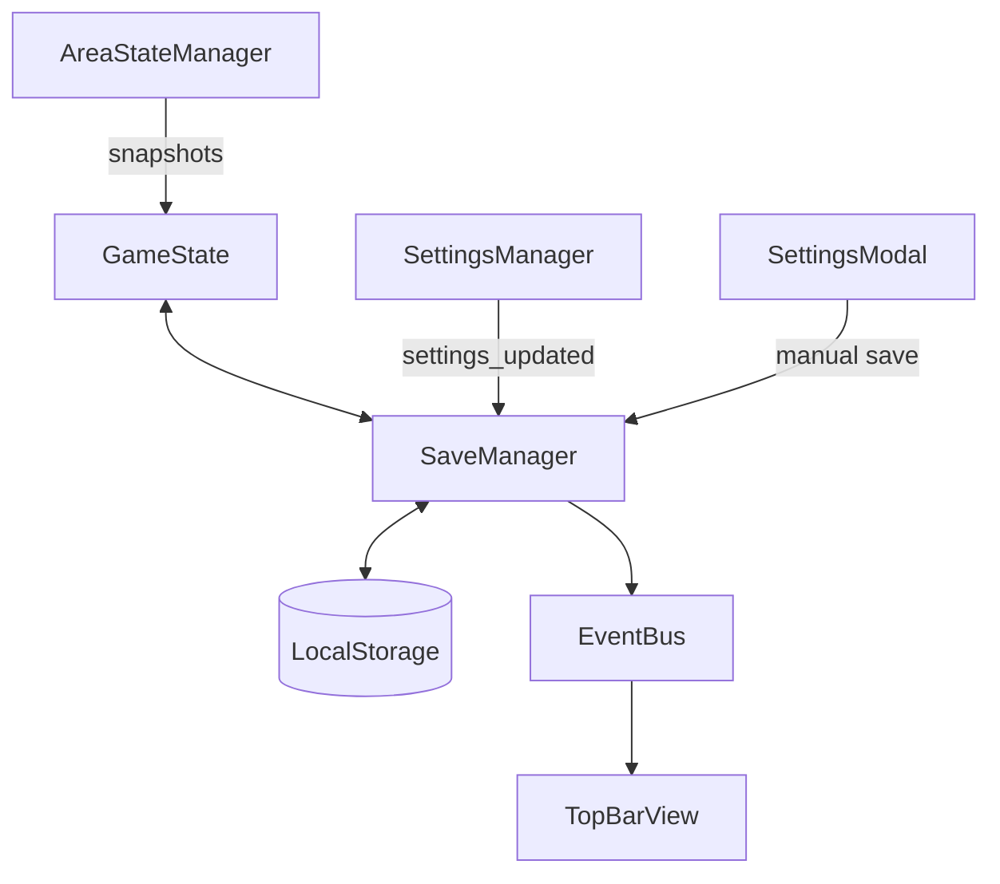

# Architecture: Save & Persistence System

This document provides a technical deep-dive into the multi-slot, versioned save system implemented for Fantasy Guild. It is intended for both human developers and future проекту agents.

## System Overview

The save system is built on a **Singleton Manager Pattern**. It bridges the gap between the in-memory [GameState](file:///c:/Users/16048/.gemini/antigravity/scratch/fantasy_guild_v2/src/state/GameState.js#16-354) and the browser's `localStorage`, providing robustness through sequential migrations and reactive UI updates.

## Core Components

### 1. [SaveManager.js](file:///c:/Users/16048/.gemini/antigravity/scratch/fantasy_guild_v2/src/systems/core/SaveManager.js)
The brain of the persistence system.
- **Responsibilities**: 
    - Managing 3 distinct save slots.
    - Running the auto-save interval loop.
    - Sequential state migrations.
    - Synchronizing with [SettingsManager](file:///c:/Users/16048/.gemini/antigravity/scratch/fantasy_guild_v2/src/systems/core/SettingsManager.js#40-159) for interval preferences.
- **Key Methods**:
    - [save(showNotification)](file:///c:/Users/16048/.gemini/antigravity/scratch/fantasy_guild_v2/src/systems/core/SettingsManager.js#74-86): Serializes [GameState](file:///c:/Users/16048/.gemini/antigravity/scratch/fantasy_guild_v2/src/state/GameState.js#16-354) and commits to `localStorage`.
    - [loadSlot(index)](file:///c:/Users/16048/.gemini/antigravity/scratch/fantasy_guild_v2/src/systems/core/SaveManager.js#234-268): Rehydrates [GameState](file:///c:/Users/16048/.gemini/antigravity/scratch/fantasy_guild_v2/src/state/GameState.js#16-354) from a slot, running migrations first.
    - [migrateState(state, version)](file:///c:/Users/16048/.gemini/antigravity/scratch/fantasy_guild_v2/src/systems/core/SaveManager.js#207-233): Recursively fills missing properties and executes logic updates.

### 2. [GameState.js](file:///c:/Users/16048/.gemini/antigravity/scratch/fantasy_guild_v2/src/state/GameState.js)
The source of truth for the entire game session.
- **Responsibilities**:
    - Serializing the reactive state into a flat JSON object.
    - Rehydrating entity aggregators (Heroes, Cards) from raw data.
- **Structure**: Uses `INITIAL_STATE` from [StateSchema.js](file:///c:/Users/16048/.gemini/antigravity/scratch/fantasy_guild_v2/src/state/StateSchema.js) as its template.

### 3. [AreaStateManager.js](file:///c:/Users/16048/.gemini/antigravity/scratch/fantasy_guild_v2/src/systems/area/AreaStateManager.js)
Handles "Regional Persistence".
- **Responsibilities**:
    - Generating snapshots of the current area's card configurations.
    - Restoring assigned heroes, combat styles, and health when returning to an area.

## Data Lifecycle

### Serialization Flow
1. `SaveManager` calls `GameState.serialize()`.
2. [GameState](file:///c:/Users/16048/.gemini/antigravity/scratch/fantasy_guild_v2/src/state/GameState.js#16-354) gathers all nested objects (Roster, Inventory, Playmat).
3. `AreaStateManager` contributes a `snapshots` map of current card states.
4. `SaveManager` wraps the resulting object with a `version` and `savedAt` timestamp.

### Rehydration Flow
1. `SaveManager` reads JSON from `localStorage`.
2. [migrateState](file:///c:/Users/16048/.gemini/antigravity/scratch/fantasy_guild_v2/src/systems/core/SaveManager.js#207-233) is called to bridge the gap between the saved version and the current `GAME_VERSION`.
3. `GameState.initFromSave(migratedState)` is called.
4. [GameState](file:///c:/Users/16048/.gemini/antigravity/scratch/fantasy_guild_v2/src/state/GameState.js#16-354) rebuilds lookup caches and rebinds reactive listeners.

## Migration System

Migrations are stored in an internal array within `SaveManager` (or moved to a separate `Migrations.js` as the project grows).

> [!IMPORTANT]
> When adding a new top-level property to the game state, always update `INITIAL_STATE` in [StateSchema.js](file:///c:/Users/16048/.gemini/antigravity/scratch/fantasy_guild_v2/src/state/StateSchema.js). The [migrateState](file:///c:/Users/16048/.gemini/antigravity/scratch/fantasy_guild_v2/src/systems/core/SaveManager.js#207-233) function will automatically find the missing key and inject the default value for old saves.

## UI & Feedback

- **[TopBarView.jsx](file:///c:/Users/16048/.gemini/antigravity/scratch/fantasy_guild_v2/src/ui/components/TopBarView.jsx)**: Subscribes to `game_saved` and `settings_updated` to show the current interval and "Last Saved" time.
- **[SlotSelectionModal.jsx](file:///c:/Users/16048/.gemini/antigravity/scratch/fantasy_guild_v2/src/ui/modals/SlotSelectionModal.jsx)**: Uses `SaveManager.getAllSlotInfos()` to render tiles with "Last Played" highlighting.

## Future Modifications (Agent Guidelines)

### How to add a Migration
If you make a breaking change (e.g., renaming a currency or restructuring the inventory):
1. Increment `GAME_VERSION` in [StateSchema.js](file:///c:/Users/16048/.gemini/antigravity/scratch/fantasy_guild_v2/src/state/StateSchema.js).
2. Add a transformation block in `SaveManager.migrateState`.

### How to change Storage Engine
The storage logic is isolated in [getSlotKey](file:///c:/Users/16048/.gemini/antigravity/scratch/fantasy_guild_v2/src/systems/core/SaveManager.js#27-35), [save](file:///c:/Users/16048/.gemini/antigravity/scratch/fantasy_guild_v2/src/systems/core/SettingsManager.js#74-86), and [loadSlot](file:///c:/Users/16048/.gemini/antigravity/scratch/fantasy_guild_v2/src/systems/core/SaveManager.js#234-268). To switch from `localStorage` to `IndexedDB` or a cloud-sync solution, only these methods in `SaveManager` need to be modified.
