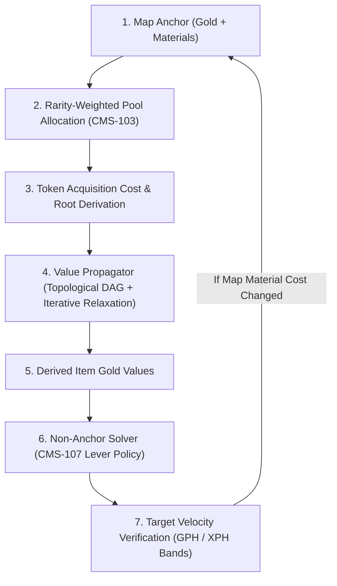

# CMS Balance Engine & Solver Architecture Plan (CMS-107 Resolution)

## Overview
This document establishes the design, mathematical model, and implementation architecture for the **CMS Balance Engine and Solver** (Phase 8 of the CMS Rework). It formally resolves **CMS-107** by defining a deterministic, predictable lever-tuning policy for automatically balancing tokens, recipes, and items while deriving accurate gold values from Map anchors.

---

## 1. Problem Analysis & Core Economics

The balance engine performs two tightly coupled jobs:



### Job 1: Value Derivation (Map Anchor $\to$ Items)
1. **Map Anchor**: Each Map has a total burst sell value target $V_{\text{burst}} = (\text{MapGoldPrice} + \text{MaterialValue}) \times \text{SellRatio}$.
2. **Pool Slicing**: $V_{\text{burst}}$ is distributed across pool entries inversely proportional to drop weight (rarity premium per CMS-103).
3. **Root Item Derivation**: For primary resource tokens:
   $$\text{Value}_{\text{item}} = \frac{\text{TokenAcquisitionCost}}{\text{charges} \times (\text{avgQuantity} \times \text{dropChance})}$$
   *(For unlimited charges, use the assumed-lifetime dial per CMS-104).*
4. **Graph Propagation**: Value cascades through processing chains (Stations & Recipes) with an authored complexity/level markup (target ~5% net margin scaling by level).
5. **Iterative Relaxation (CMS-47, CMS-108)**: Because Maps consume materials produced by the system, the propagator loops until item values converge ($\Delta < 0.01\text{g}$).

### Job 2: Non-Anchor Balancing (Velocity Alignment)
- An item's value is **anchored only once** by its cheapest primary path (CMS-45).
- **6 of 15 current produced items have multiple sources** (e.g. Oak Wood, Copper Ore, Glowcap, Spider Silk).
- Secondary/alternative sources cannot re-derive the item's value; instead, the solver **tunes the non-anchor Token's parameters** until its earn rate lands within the level's target gold-per-hour (GPH) and XP-per-hour (XPH) velocity band.

---

## 2. Lever Policy Specification (Resolving CMS-107)

### The Four Levers Evaluated
1. **Drop Value**: ❌ **Forbidden / Output Only**. Moving this would destabilize the entire anchor chain.
2. **Frequency (Cycle Time)**: ⚠️ **Fallback Only (Restricted)**. Hard-bounded to 10–30s (D-164). Governs board feel and rhythm. Solver must avoid altering hand-authored cycle times unless all other levers fail.
3. **Quantity (Yield per Cycle)**: ✅ **Primary Lever for Steady/Crafting Producers**. Can use discrete integers or integer Min-Max ranges (`[minQty, maxQty]`, e.g. $1\text{--}2 \implies \text{avg } 1.5$) to provide fine expected-value steps while keeping discrete integer drops.
4. **Chance (Drop Probability %)**: ✅ **Primary Lever for Probabilistic/Secondary Drops & Enemies**. Continuous and fine-grained, with legibility snapping to $10\% \to 5\% \to 1\%$.

---

### Policy Matrix by Token & Recipe Kind

```
┌─────────────────────────────────────────────────────────────────────────────────┐
│                                TOKEN CLASSIFICATION                             │
└───────────────┬────────────────────────┬───────────────────────┬────────────────┘
                │                        │                       │
                ▼                        ▼                       ▼
    ┌──────────────────────┐ ┌──────────────────────┐ ┌──────────────────────┐
    │  Resource (Primary)  │ │   Station / Recipe   │ │    Enemy (Combat)    │
    ├──────────────────────┤ ├──────────────────────┤ ├──────────────────────┤
    │ If Chance < 100%:    │ │ Main Output:         │ │ Cycle time ignored   │
    │  Tune CHANCE (10-100)│ │  Keep Chance = 100%  │ │  (CMS-51).           │
    │ If Chance = 100%:    │ │  Tune QUANTITY/RANGE │ │ Tune CHANCE (5% snap)│
    │  Tune QUANTITY/RANGE │ │ Secondary Output:    │ │ Fallback: QUANTITY   │
    │ Fallback: CYCLE TIME │ │  Tune CHANCE         │ │                      │
    └──────────────────────┘ └──────────────────────┘ └──────────────────────┘
```

#### 1. Resource Tokens (Gathering from nothing)
- **If authored with Chance < 100%** (probabilistic / rare find):
  - **1st Priority**: Tune **Chance** (snapped to 10% / 5% / 1%).
  - **Bounds**: Floor at $10\%$, Ceiling at $100\%$.
  - **Fallback**: If Chance hits bounds and GPH is still out of band, adjust **Quantity Min-Max Range**.
- **If authored with Chance = 100%** (steady metronome):
  - **1st Priority**: Maintain $100\%$ chance (preserves metronome feel). Tune **Quantity Min-Max Range** (e.g. $2 \to [1, 2] \to 1$).
  - **Bounds**: Minimum quantity $1$.
  - **Fallback**: If Quantity is at $1$ and GPH is still too high, step Chance down below $100\%$ with snapping.
- **Last Resort Fallback**: If Quantity = 1 and Chance = 10%, adjust **Cycle Time** strictly within the [10s, 30s] band (D-164).
- **Refusal**: If still out of band, raise a **Critical Audit Warning** (Refuse to zero out yield or exceed 30s).

#### 2. Stations & Recipes (Transforming inputs)
- **Main Output**: Always $100\%$ chance. Player crafting never fails to yield the main item.
  - Tune **Output Quantity** or **Quantity Range** if recipe is over/under target value margin.
- **Secondary / Byproduct Outputs** (e.g., Slag, Ash, Bonus Spores):
  - Tune **Chance** (snapped to 5%).
- **Refusal**: If input cost exceeds output value at minimum yields, flag as **Negative Margin Defect** rather than adjusting station speed.

#### 3. Enemies & Combat Encounters
- Enforce CMS-51: **Total Lifetime Value vs. Acquisition Cost** (time dimension / cycle time is excluded).
- Tune **Drop Chance** (snapped to 5% / 1%), with **Drop Quantity** as secondary lever.

---

### Invariant Rules & Restraints (What the Solver Refuses to Do)

> [!IMPORTANT]
> The solver operates autonomously (CMS-14), so hard restraints prevent degenerate content generation:
> 1. **D-164 Invariant**: Cycle times must NEVER be adjusted below 10s or above 30s.
> 2. **No Zero Yields**: Output quantity cannot be set to 0. Minimum is 1 (or min: 1, max: 1).
> 3. **Chance Floor**: Primary resource chance cannot be auto-tuned below $10\%$ (prevents dead tokens).
> 4. **Unreachable Items (CMS-86)**: Items with no derivation path are never assigned arbitrary values; they raise a Critical Audit Error.
> 5. **Tolerance Band**: Implied GPH within $\pm 5\%$ of target velocity is considered balanced and **untouched** by the solver.

---

## 3. CMS Decision Records to Land

We will record decisions **CMS-109 through CMS-113** in `cms_rework_v2_decisions.md` and mark **CMS-107** resolved:

- **CMS-107**: *RESOLVED* $\to$ Point to CMS-109 through CMS-113.
- **CMS-109 — Lever Priority Policy**: Resource tokens prioritize Chance for probabilistic drops and Quantity Ranges for steady metronome drops; Crafting main outputs lock at 100% chance and tune Quantity; Enemy loot tunes Chance with no time dimension.
- **CMS-110 — Quantity Min-Max Range Adoption**: The solver is authorized to emit integer min-max ranges (`[minQty, maxQty]`) to bridge discrete integer yield steps.
- **CMS-111 — Legibility Snapping & Tolerance Bands**: Implied velocity within $\pm 5\%$ is untouched. Tuned drop chances snap to $10\% \to 5\% \to 1\%$ intervals.
- **CMS-112 — Restraint Invariants & Hard Audit Refusals**: Solver halts and raises an Audit Warning if a solution requires $T_{\text{cycle}} \notin [10, 30]\text{s}$, $\text{Chance} < 10\%$, or $\text{Yield} < 1$.
- **CMS-113 — Decoupled Two-Stage Engine Architecture**: Job 1 (Anchor & Propagator) and Job 2 (Velocity Solver) execute as decoupled pure calculators communicating via standard registries.

---

## 4. Technical Architecture & File Structure

```
cms/src/engine/
├── anchorCalculator.js       # [NEW] Job 1: Map price anchor + pool rarity allocation (CMS-44, 48, 103, 108)
├── valuePropagator.js        # [MODIFY] Job 1: Iterative DAG propagation, markup scaling, cheapest-path resolution
├── tokenSolver.js            # [NEW / REPLACES taskSolver.js] Job 2: Multi-lever velocity solver implementing CMS-109-112
├── evCalculator.js           # [MODIFY] GPH / XPH velocity calculation for tokens, recipes, and enemies
├── connectivityAuditor.js    # [MODIFY] Graph audit, orphaned items, and solver refusal warnings (CMS-86)
└── balanceRunner.js          # [NEW] Orchestrator running Anchor -> Propagate -> Solve -> Relax loop on demand (CMS-16)
```

---

## Proposed Changes

### Component 1: CMS Decision Documentation
#### [MODIFY] [cms_rework_v2_decisions.md](file:///c:/Users/16048/Projects/fantasy_guild_v2/cms_rework_v2_decisions.md)
- Update CMS-107 to resolved status.
- Append new numbered decisions CMS-109 through CMS-113 following the established house style (Decision, Why, Rejected alternatives, Cost accepted).

---

### Component 2: Anchor & Value Propagation (Job 1)
#### [NEW] [anchorCalculator.js](file:///c:/Users/16048/Projects/fantasy_guild_v2/cms/src/engine/anchorCalculator.js)
- Implements Map burst pricing formula with gold + material cost.
- Allocates entry values by inverse draw weight according to CMS-103.
- Computes per-token charge cost and initial root item values.

#### [MODIFY] [valuePropagator.js](file:///c:/Users/16048/Projects/fantasy_guild_v2/cms/src/engine/valuePropagator.js)
- Replaces legacy card task inputs with 7x7 Token & Recipe schema.
- Iterative relaxation loop until all item values stabilize.
- Enforces CMS-45 (cheapest acquisition path as anchor).

---

### Component 3: Non-Anchor Solver (Job 2)
#### [NEW] [tokenSolver.js](file:///c:/Users/16048/Projects/fantasy_guild_v2/cms/src/engine/tokenSolver.js)
- Implements the multi-tier lever policy (CMS-109, CMS-110, CMS-111).
- Evaluates token implied GPH/XPH against target velocity bands.
- Applies Chance tuning (snapped) $\to$ Quantity Range tuning $\to$ Cycle time fallback $\to$ Audit Refusal.

#### [MODIFY] [evCalculator.js](file:///c:/Users/16048/Projects/fantasy_guild_v2/cms/src/engine/evCalculator.js)
- Updates EV and velocity calculations to support `minQty`/`maxQty` ranges and token work cycle formulas.

#### [MODIFY] [connectivityAuditor.js](file:///c:/Users/16048/Projects/fantasy_guild_v2/cms/src/engine/connectivityAuditor.js)
- Connects solver refusal events (out of band, negative margins, orphaned items) to generate Critical and Warning rows for `AuditPanel.jsx`.

---

### Component 4: Orchestration & Tests
#### [NEW] [balanceRunner.js](file:///c:/Users/16048/Projects/fantasy_guild_v2/cms/src/engine/balanceRunner.js)
- Single entry point for on-demand recalculation (CMS-16).
- Executes Anchor $\to$ Propagate $\to$ Solve $\to$ Settle convergence.

#### [NEW] [tokenSolver.test.js](file:///c:/Users/16048/Projects/fantasy_guild_v2/cms/src/tests/tokenSolver.test.js)
- Unit tests verifying:
  - Resource steady metronome preserves 100% chance and tunes quantity range.
  - Resource probabilistic drops tune chance and snap to clean increments.
  - Recipe outputs preserve 100% main chance and tune quantity.
  - Cycle time stays strictly within 10s–30s.
  - Refusals trigger audit warnings when constraints cannot be met.

---

## Verification Plan

### Automated Tests
- Run CMS test suite:
  ```powershell
  npm test -- --grep "tokenSolver|valuePropagator|anchorCalculator"
  ```
- Verify content rules remain green:
  ```powershell
  npm test -- src/tests/ContentRules.test.js
  ```

### Balance Convergence Verification
- Execute a headless balance run over the current 41 tokens, 63 items, and 2 maps.
- Confirm that all 6 multi-source items converge to identical sell prices.
- Verify that non-anchor tokens land within $\pm 5\%$ of their target level velocity band.
- Ensure no cycle times violate the 10–30s D-164 band.
