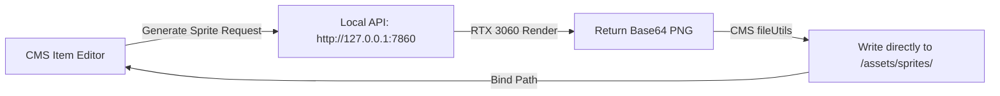

# Technical Plan — Local Art Generation & LoRA Training Setup

This document establishes the roadmap to set up a local, offline art generation environment using your **NVIDIA RTX 3060 (12GB VRAM)**. This pipeline covers dataset preparation, Kohya_ss LoRA training configurations, local API servers, and CMS automation hooks.

---

## Phase 1: Dataset Preparation & Upscaling

To train a high-quality style LoRA, you need a curated dataset of consistent pixel art (30–100 images) upscaled using **Nearest Neighbor interpolation** to prevent the neural network's compression system (VAE) from destroying the details.

### A. Batch Upscaling Script
We will provide a Node/Python script in the repository (e.g. `scripts/prepare_dataset.js`) to automate upscaling. 
* **Operation:** Reads raw 32x32px sprites (for items) or 256x256px canvases (for backgrounds), scales them by **16x** (or **4x** respectively) to target **512x512px**, using sharp pixel duplicates.
* **Metadata files:** Creates matching `.txt` caption files for each image with tag keywords.

---

## Phase 2: Local LoRA Training Configuration (Kohya_ss)

We will configure **Kohya_ss** (the open-source training tool) to run on your local RTX 3060:

### Optimal Parameters for RTX 3060 (12GB VRAM)
* **Base Model:** Set to your local Retro Diffusion checkpoint (`.safetensors` format, based on SD 1.5).
* **Optimizer:** Set to `AdamW8bit` (crucial for keeping VRAM usage under 8–10 GB).
* **Precision:** Set `Mixed Precision` and `Save Precision` to `fp16`.
* **Network Rank/Alpha:** Set `Network Rank (Dimension)` to `16` or `32`, and `Network Alpha` to `16` or `32` (standard for learning stylistic outlines).
* **Batch Size:** Set to `1` or `2` with `Gradient Checkpointing` enabled to ensure absolute VRAM stability.
* **Epochs/Steps:** Aim for **1,500 to 3,000 total training steps** (usually around 10–15 epochs for a 50-image dataset).

---

## Phase 3: Stable Diffusion WebUI API Setup

We will configure the local Stable Diffusion WebUI (Automatic1111) to act as a background rendering engine for the CMS.

1. **Launch Arguments:** Modify your local startup batch file (`webui-user.bat`) to launch in background API mode with Cross-Origin Resource Sharing enabled so the CMS web browser can communicate with it:
   ```bash
   set COMMANDLINE_ARGS=--api --cors-allow-origins http://localhost:5173
   ```
2. **LoRA folder:** Drop your newly trained LoRA file into `models/Lora/`.

---

## Phase 4: CMS API Integration

Once the local GPU server is running, we will build a connector module inside the CMS to generate assets automatically.



### Proposed CMS Art Generator Hook
We will add `cms/src/engine/artGenerator.js` with the following call:
```javascript
export async function generateSprite(prompt, type = 'item') {
  const payload = {
    prompt: `pixel art, FG_STYLE icon, ${prompt}, <lora:FG_Items:0.85>`,
    negative_prompt: "blurry, smooth, photorealistic, 3d render, gradients, anti-aliased",
    steps: 20,
    width: 512,
    height: 512,
    cfg_scale: 7,
    sampler_name: "Euler a"
  };

  const response = await fetch('http://127.0.0.1:7860/sdapi/v1/txt2img', {
    method: 'POST',
    headers: { 'Content-Type': 'application/json' },
    body: JSON.stringify(payload)
  });

  const data = await response.json();
  const base64Image = data.images[0];
  
  // Send base64 to local Vite API plugin to save image directly to public assets folder
  return saveGeneratedAsset(base64Image, type);
}
```
