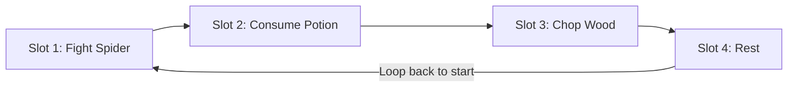

# Concept Design: Area Deck Loop System

This document outlines the design concepts for replacing the spatial **Playmat System** with a streamlined, automated, and deterministic **Area Deck Loop System**.

---

## 1. Vision & Core Philosophy

*   **From Spatial Clutter to Pipeline Optimization:** We are moving away from 2D coordinate-based grid systems (which cause visual clutter, high drag-and-drop friction, and layout micromanagement) to a linear, 1D queue representation of each Area.
*   **True "Idle" Gameplay:** The game executes player-configured routines deterministically. The player can walk away for hours knowing exactly what sequence their hero will execute, allowing for clean offline/background progression.
*   **Evoking Deckbuilding Games:** Cards feel like action commands and tactical choices. Players construct a "routine deck" for their hero in each area, optimizing the balance between gathering resources, fighting hazards, healing, and resting.

---

## 2. The Core Loop (Deterministic Queue)

Instead of moving a hero token around a map, the hero is assigned to an **Area Deck** (represented as a horizontal row on the screen). 



*   **Sequential Execution:** The hero executes the cards in the deck in sequence (1 → 2 → 3 → ... → N).
*   **Infinite Loop & Pacing Intermissions:** Upon completing the last card in the sequence, the hero wraps around to the first card, running the deck loop indefinitely. To balance loop lengths and penalize trivial spamming, we introduce **intermission times**:
    *   **Draw Time:** A delay of **1 to 2 seconds** occurs whenever transitioning to the next card slot (the drawing phase).
    *   **Shuffle Time:** A delay of **5 to 10 seconds** occurs when wrapping from the last card in the sequence back to the first card (the deck reshuffling phase).
    *   *Design Impact:* Shuffling and drawing overhead encourages players to expand their deck size and use full rotations, as extremely small decks will spend a disproportionate amount of time stalled in the shuffle phase.
*   **Time-Based Resolution:**
    *   Every card has a **minimum duration of 1 second**.
    *   Standard actions have a specific **Task Time** (e.g., *Chop Wood* takes 15 seconds, *Rest* takes 30 seconds).
    *   Special card types, such as **Consumables**, resolve after a set **Consumption Time** (e.g., 3 seconds).
*   **One Hero per Area:** Each Area accommodates exactly one hero, focusing the player's optimization efforts on pairing the right hero with the right area routine.

---

## 3. Deck Structure & Slot Types

Each Area’s deck starts with a unique default layout depending on the environment (e.g., *Seaside Village* starts with three Fishing Slots). Slots are categorized as follows:

### A. Regular Slots
*   Generic slots where the player can drag and drop any valid action card.

### B. Specialized Slots
*   Slots that only accept specific categories of cards.
*   *Example:* A **Food Slot** that only accepts consumable food items.
*   *Dynamic Addition:* Certain Station Cards can dynamically append Specialized Slots to the deck when active (e.g., building/equipping a *Dock Station* adds 1 Fishing Slot to that Area's Deck).

### C. Boost Slots
*   Slots that apply modifiers/improvements to specific categories of cards matching their tag.
*   *Example:* A **Nature Boost Slot** that increases resource yield by +20% or decreases task duration by 15% *only* for cards with the `[Nature]` tag placed inside it.

### D. Hard-Coded / Environmental Slots (Locked)
*   Represent the innate features or hazards of the Area.
*   *Example:* In a poisonous swamp area, Slot 2 might be locked to a permanent `[Poison Hazard]` card. Every time the loop passes this slot, the hero takes poison damage.
*   These hazards are interacted with and mitigated via the Area's Skill Tree.

---

## 4. Item & Consumable Integration

Consumable cards (like food, potions, or single-use buffs) can be slotted directly into the deck.

*   **Banked Inventory Binding:** The slotted card acts as an active pipeline filter pointing to the global/guild inventory. It does not disappear when exhausted.
*   **Execution Logic (The "Skip" Behavior & Penalty):**
    *   *If Item is available:* The hero reaches the slot, consumes 1 unit of the item (e.g., 1x Steak from the bank) during the **3-second Consumption Time**, receives the instantaneous effect (e.g., +50 HP), and proceeds.
    *   *If Item is NOT available (0 in bank):* The hero still pauses at the slot for the **3-second Consumption Time** as a penalty for failing to stock the item, but receives no benefit before moving to the next slot.
*   **Resupply Automation:** Because the slot remains in the deck even when empty, other heroes in different areas harvesting meat and cooking steaks can resupply the bank. Once steaks are available again, the loop automatically resumes consuming them without requiring player intervention.

---

## 5. Area Progression: Area Skill Trees (Future Implementation)

Instead of constructing manual upgrade project cards directly in the deck slots, Area progression will eventually be managed through a dedicated **Area Skill Tree**.

*   **Tree Upgrades:** Players spend items gathered from the Area to buy passive nodes in the tree.
*   **Mitigating Hazards:** Upgrades in the tree can permanently weaken or remove environmental hazards.
    *   *Example:* Upgrading the "Light the Way" node in the Oak Forest tree permanently neutralizes the accuracy penalty of the `[Dark Cavity]` hazard slot.
*   **Other Upgrades:** Tree nodes can unlock new deck slots, upgrade regular slots to Boost Slots, or increase specific resource yield rates in that Area.

---

## 6. The Outpost System (Adventure vs. Stationed Mode)

To balance active gathering with safe crafting and processing, each Area features a single **Hero Slot** but offers two distinct operational modes that the player can toggle:

*   **Adventure Mode (The Wilds):** The hero actively runs the sequential deck loop through the dangerous wilds of that Area. They take damage, consume inventory items, and harvest raw materials.
*   **Stationed Mode (The Outpost):** The hero retreats to the safety of the Area's local camp or outpost.
    *   The Wilds deck loop is **paused**.
    *   The hero is safe from combat hazards and does not take damage.
    *   The hero performs tasks associated with the active **Station Card** (e.g., refining raw materials or crafting queued items).

---

## 7. Outpost Stations & Crafting

Stations are represented as cards themselves and are slotted or removed like any other card in the deck setup.

*   **Refining & Crafting:** When a hero is switched to *Stationed Mode*, they will process the queue of the active slotted Station Card.
    *   *Example (Lumber Mill Card):* Processes *Oak Logs → Oak Planks*.
    *   *Example (Smelter Card):* Processes *Iron Ore + Coal → Iron Bars*.
*   **Simplicity First:** In early implementation, Station Cards can be easily switched in and out of the deck. Passive upgrade trees for Stations may be added in future iterations.

---

## 8. Pack Purchases & Card Pool Economy

To acquire new action and station cards, players purchase randomized Booster Packs using gold generated by the guild.

### A. Unified Booster Pack
*   Instead of separate packs per Area, there is a **single Booster Pack** type.
*   As the player unlocks new Areas, the cards associated with those Areas are dynamically added to the unified pack's pool.

### B. Single-Copy Rule & Capped Pools
*   **Deck Limit:** A player can only slot a **maximum of 1 copy** of any given action card in a single Area Deck. However, they can use their other copies of the same card across different Area Decks (e.g., if they own 3 copies of *Chop Wood*, they can run it in 3 different Areas, but only once per Area).
*   **Capped Card Pool:** The card pool has a hard ceiling. Once the player has obtained **4 copies** of a specific card, that card is permanently removed from the pack opening pool. It will never appear in pack openings again, eliminating the need for a complex salvaging/recycling system.

---

## 9. Action Card Logic: Inputs & Status Buffs

Action cards are not just simple tasks; they can manipulate resources and hero state dynamically across the loop.

### A. Resource-Consuming Tasks (Inputs)
*   **Example (Salt Circle):** Consumes 1x `[Salt]` from the inventory to apply a loop-wide buff: `[Salt Shield]`.
*   **Failsafe Check:** If the inventory lacks the required input, the card still consumes its task duration, but the hero moves to the next slot without receiving the buff.

### B. Temporary Loop Buffs
*   Cards can apply temporary status effects that expire after a certain number of slots or at the end of the current loop cycle.
*   **Example (Pre-emptive Strike):** A combat card that grants `[First Strike]` to the hero. This buff is held until the hero enters a combat card slot, then it is consumed.
*   **Example (Cookout):** Slotted before a series of gather tasks; grants a +10% gathering yield buff for the next 3 slots in the sequence.

---

## 10. Hero Defeat & Death Penalty

To prevent players from running loops that are too dangerous for their heroes, we implement a **Forced Retreat** penalty upon defeat.

### A. The Forced Retreat
*   If a hero's health drops to 0 during an Adventure Mode card slot, the adventure loop immediately halts.
*   The hero is automatically switched to **Stationed Mode** at the Outpost and receives the `[Injured]` status condition.
*   While `[Injured]`, the hero cannot re-enter Adventure Mode. They must remain stationed at the Outpost to heal passively over time, or the player can spend healing resources (like potions or food) to cure them immediately.

### B. Death Penalty (Loss of Assets)
*   All gathered resources are deposited directly to the global Guild Bank instantly when harvested. 
*   However, if a hero is defeated, the player suffers targeted penalties directly to active assets:
    *   **Loop Item Loss:** A portion of the stack of active consumable/item cards currently slotted in that loop is destroyed/depleted.
    *   **Permanent Equipment Loss:** There is a percentage chance for the hero to lose equipment (weapons/armor) currently attached to them, representing items lost or broken in battle. This equipment loss is permanent.

---

## 11. UI Layout & Visual Presentation

The UI is optimized to show multiple Areas concurrently without vertical or horizontal bloat. Each Area is represented as a single streamlined horizontal row, organized into a specific sequence of components.

### A. Static Pillars (Always Visible)

No matter which mode is active, the left and right anchors of the Area row remain visible to ensure layout stability:

1.  **Control Panel:** (0.5 Card Space) — Positioned on the absolute far left. Contains basic operational buttons:
    *   *Start/Stop:* Pauses or resumes the active mode (looping or crafting).
    *   *Hide/Show:* Collapses the entire Area row to a thin banner to save screen real estate.
2.  **Info Panel:** (1.0 Card Space) — Displays live data like combat stats (Health/Energy bars) and a text activity log.
3.  **Hero Slot:** (1.0 Card Space) — Displays the assigned hero's portrait, status, and gear level. Drag-and-drop target to assign or switch heroes. Clicking opens the inline **Equip Focus** mode.
4.  **Station Slot (Rightmost):** (1.0 Card Space) — Displays the currently constructed Outpost building card (e.g., Lumber Mill). Clicking the card triggers inline **Upgrade Focus** or **Recipe Focus**.

---

### B. The 4-Space Flexible Area

The middle section (4.0 Card Spaces) changes dynamically based on which slice of the 80/20 split banner is selected:

#### 1. Area View (Wilds Active - 80% width)
Focuses on the active adventure loop:
*   **Active Card:** (1.0 Card Space) — Full-fidelity card representation of the action currently being performed, complete with a visual timer overlay.
*   **Upcoming Loop Track:** (2.0 Card Spaces) — Displays upcoming cards in the queue as semi-transparent previews. This section scales dynamically with horizontal screen width (showing more upcoming cards on wider displays).
*   **Area Deck Button:** (1.0 Card Space) — Displays the deck's card art. Clicking opens the inline **Deck Focus** mode.

```
+---------------------------------------------------------------------------------------------------------+
| [ CONTROL ] [ INFO ] [ HERO ] [   ACTIVE CARD   ] [     UPCOMING TRACK     ] [ AREA DECK ] [ STATION ]  |
|   (0.5s)      (1.0s)   (1.0s)       (1.0s)         (2.0s - Dynamic Width)       (1.0s)       (1.0s)     |
+---------------------------------------------------------------------------------------------------------+
```

#### 2. Station View (Outpost Active - 80% width)
Focuses on the active crafting/processing station:
*   **Output Slot:** (1.0 Card Space) — Displays the item currently being produced. Clicking opens the inline **Recipe Focus**.
*   **Crafting Controls:** (1.0 Card Space) — Controls to set production limits (e.g. quantity caps or infinite run toggles) and displays performance data (e.g. time per craft, expected yields).
*   **Input Slots:** (2.0 Card Spaces) — Shows the required ingredients for the active recipe. To optimize density, each slot displays **3 items horizontally/vertically**, listing the item icon, name, and current quantity in the guild bank. This supports recipes requiring up to 6 unique ingredients.

```
+---------------------------------------------------------------------------------------------------------+
| [ CONTROL ] [ INFO ] [ HERO ] [  OUTPUT SLOT  ] [ CRAFTING CONTROLS ] [    INPUT SLOTS    ] [ STATION ] |
|   (0.5s)      (1.0s)   (1.0s)      (1.0s)             (1.0s)            (2.0s - 6 items)     (1.0s)     |
+---------------------------------------------------------------------------------------------------------+
```

---

### C. The 80/20 Split-Banner Mode Toggle

Instead of a generic checkbox or switch, the **Area Banner** itself serves as the toggle between Adventure Mode and Stationed Mode:

*   **Visual Design:** The banner is split vertically into two unequal slices (80% and 20% width):
    *   *The Wilds Slice:* Showcases art of the dangerous area (e.g., dark forest, spooky caves).
    *   *The Station Slice:* Showcases art of the active outpost building (e.g., a lumber mill, smithy forge).
*   **Sliding Barrier Interaction:**
    *   Clicking the inactive slice slides the split barrier to the opposite side, reversing the width layout (e.g., shifting the Station Slice from 20% to 80% width).
    *   The active slice (occupying 80% width) displays the card slots and key operational information for that mode.

---

### D. The Inline "Focus View" Interaction Pattern

Instead of opening separate screen-blocking modal popups, clicking configuration components triggers an **inline morphing effect** directly on the active banner row.

*   **Visual Focus (Dimming):** 
    *   The clicked Area banner remains fully illuminated.
    *   All other Area rows on the screen are dimmed to direct the player's focus.
*   **Inline Row Morphing:** 
    *   The regular elements in the active row are temporarily hidden.
    *   The row space is replaced by the relevant focus view layout.
*   **Overflow Scrolling:** 
    *   Since configuration screens require multiple inputs, the focus view layouts can exceed the 7.5 card space width. The banner row allows **horizontal side-to-side scrolling** to let the player view and interact with overflow elements.
*   **Specific Focus Modes:**
    1.  **Deck Focus (Clicking Area Deck):** Hides the normal slots and displays the horizontal chain of the deck's active slots, allowing cards to be dragged or selected in/out.
    2.  **Equip Focus (Clicking Hero Slot):** Shows a dedicated card slot for each equipment type (Weapon, Armor, Shield, Accessory) and a panel displaying the hero's active stats.
    3.  **Recipe Focus (Clicking Output Slot):** Shows each possible crafting recipe card side-by-side in the scrollable row slots. Clicking a recipe locks it in.
    4.  **Upgrade Focus (Clicking Station Card Button):** Shows the station's available upgrade options, costs, and benefits.

---

## 12. Overall UI & Bottom Drawer System

To replace the sidebars and unify player inventory management, the main interface features a persistent **Bottom Drawer System** toggled by folder tabs.

### A. Three-Pane Tab Workspace Layout

When a folder tab (Heroes, Cards, Stations, Bank) is opened, the drawer expands to reveal a standardized three-pane workspace:

```
+-------------------------------------------------------------------------------+
| [ SEARCH & FILTER PANEL (Top - Horizontal Bar) ]                              |
| +------------------------+ +------------------------------------------------+ |
| |                        | |                                                | |
| |    INSPECTION PANEL    | |                   MAIN VIEW                    | |
| |      (Left Pane)       | |                 (Center Pane)                  | |
| |                        | |                                                | |
| |  * High-Res Card Art   | |  * Grid of Heroes, Cards, or Bank Materials    | |
| |  * Detailed Stats      | |  * Displays basic status/counts                | |
| |  * Lore & Description  | |  * Items can be dragged out of here            | |
| |                        | |                                                | |
| +------------------------+ +------------------------------------------------+ |
+-------------------------------------------------------------------------------+
```

1.  **Search & Filter Panel (Top):**
    *   Provides text search and type filter buttons (e.g. filtering the Bank by *Consumables*, or Cards by *Combat*).
2.  **Inspection Panel (Left Side):**
    *   Acts as the detail viewer. Clicking any item, hero, or card in the center pane locks it into the inspection panel.
    *   Displays full-resolution retro card art, detailed lore, attribute breakdowns, and crafting ingredients.
3.  **Main View (Center/Right):**
    *   A grid-based gallery showcasing the items under the active tab.
    *   All items in this panel are active drag sources for the Area Banners above.

---

### B. Ergonomic QoL Interactions (Auto-Open & Filter)

To reduce menu navigation friction, the drawer automatically responds to empty slots in the active Area rows:

*   **Contextual Auto-Open:** Clicking any empty slot in an Area row (e.g. an empty Hero Slot, an empty Food Slot, or an empty Station Slot) automatically opens the bottom drawer.
*   **Smart Filtering:** Upon auto-opening, the drawer switches to the relevant folder tab and applies a filter matching the slot's requirements.
    *   *Example:* Clicking an empty **Food Slot** automatically opens the **Bank Tab** and filters it to show only edible consumables.
    *   *Example:* Clicking an empty **Station Slot** automatically opens the **Stations Tab** showing only buildable outpost cards.

---

## Appendix A: Example Deck Slot Attributes

Deck slots can possess passive rules, requirements, or modifiers that alter the execution of any card placed inside them:

### 1. Requirements & Gates (Locks)
*   **Tag Lock:** The slot only accepts cards with a specific tag (e.g., `[Fishing Tasks Only]` or `[Rest Tasks Only]`).
*   **Tool Requirement:** Executing a card in this slot requires the hero to have a specific item type equipped (e.g., `Requires Fishing Lure Equipped` or `Requires Pickaxe`).
*   **Input Upkeep:** Executing the card in this slot requires spending extra resources from the Guild Bank (e.g., `Requires +1 Coal input per loop`).
*   **Status Condition Gate (Disabling):** The slot is bypassed/disabled if the hero has a specific status effect (e.g., `Disabled if Poisoned`).
*   **Status Condition Gate (Enabling):** The slot is only executed if the hero currently possesses a specific status effect (e.g., `Only executes if Invisible` or `Only executes if Enraged`). Otherwise, it is skipped.

### 2. Efficiency & Yield Modifiers (Boosts)
*   **Yield Doubler:** `+X% chance to double [Item Type] outputs` (e.g., +25% chance to double Ore yields).
*   **Task Haste:** `-X% Task Time` (e.g., reduces task duration by 15%).
*   **XP/Mastery Booster:** `+X% Skill/Hero XP gained` from the action in this slot.
*   **Resource Efficiency:** `-X% resource input requirements` for the task placed in this slot (e.g., saves materials).

### 3. Dangers & Overhead (Costs)
*   **Energy Drain:** `Double Energy cost` (or `+X Energy cost`) to resolve the card in this slot.
*   **HP Hazard:** `Hero takes X Damage per draw` (e.g., representing hazardous terrain like a spike pit or lava flow).

---

## Appendix B: Example Action Card Effects

Action cards are slotted by the player to construct the loop. While basic resource harvesting and combat encounters are handled by standard task cards, specialized action cards interact directly with the loop's rules, pacing, and layout:

### 1. Slot Injection & Layout Manipulators
*   **Tavern:** 
    *   *Effect:* Dynamically injects **1 temporary Food Slot** and **1 temporary Drink Slot** immediately following the Tavern card in the active loop sequence.
*   **Decoy Trap:** 
    *   *Input:* Consumes high-value resources (e.g., `5x Raw Meat` and `2x Hides`).
    *   *Effect:* Temporarily overrides the next **Combat Card** (excluding **Boss Cards**) in the loop, turning it into a blank/skipped slot for one cycle.

### 2. Pacing & Loop Acceleration
*   **Active Cardio:** 
    *   *Effect:* Drains a large portion of the hero's **Energy**, but reduces the **Task Time** of all cards in the current loop cycle by 25%.
*   **Scouting Route:** 
    *   *Effect:* Reduces the deck reshuffle/reset delay (the loop wrap-around time) by a set amount (e.g., reducing the shuffle delay from 8 seconds to 3 seconds).

### 3. Temp Buffs & Yield Boosts (Draw/Loop Capped)
*   **Prospector's Map:** 
    *   *Effect:* Grants a temporary status that doubles all Ore resource yields for the next **X draws**.
*   **Whetstone:** 
    *   *Effect:* Grants the `[Sharp Blade]` status (+15% combat damage) for the next **3 combat draws**.
*   **Insulated Shield:**
    *   *Effect:* Grants a temporary resistance status that absorbs 50% of the damage dealt by environmental hazard slots for the next **1 complete loop cycle**.

### 4. Pocket Processing (Transmutation)
*   **Pocket Smelter:** 
    *   *Input:* Consumes 1x `[Coal]`.
    *   *Effect:* Instantly transmutes the next raw resource gathered (e.g., `1x Iron Ore`) directly into its refined form (`1x Iron Bar`) when drawn, bypassing the need to return to the camp's Smelter.

---

## Appendix C: Example Negative Card & Slot Effects

Negative cards, hazard slots, and curses introduce disruption and danger to the loop, requiring active mitigation:

### 1. Environmental Hazard Slots (DOT Statuses)
*   **Thorn Thicket / Lava Vent:** 
    *   *Effect:* Instantly inflicts a damage-over-time status effect on the hero (e.g., `[Bleeding]` or `[Burning]`) that ticks for damage over the next **X draws**.
*   **Mire / Muddy Ground:** 
    *   *Effect:* Slows the hero down, increasing the **Task Time** of the immediate next card slot by +50%.

### 2. Curses & Loop Disruptions (Chaos Mode)
*   **Lost / Fog:**
    *   *Effect:* Inflicts the `[Chaos]` status condition. While active, **sequential execution is temporarily overridden**. Cards are drawn and executed randomly from the deck until the next deck shuffle (reshuffle phase), which clears the status.

### 3. Loop Injuries (Clear-on-Shuffle)
*   **Sprained Ankle / Minor Injury:** 
    *   *Effect:* A card dynamically forced into the player's deck (e.g., following a critical hit from a combat card). When drawn, it takes 8 seconds of "Limping" task time and does nothing (wastes time/space). It is automatically **destroyed and cleared** when the loop wraps back around and shuffles.

### 4. Slotted Consumable Spoilage
*   **Rot / Spoilage:** 
    *   *Effect:* A card/hazard that, when reached, targets the active deck loop and **depletes 1 charge** from any slotted food/drink/potion card, but grants no benefit (representing food going bad or bottles breaking).

### 5. Unskippable Encounters (Bosses)
*   **Boss Card:**
    *   *Effect:* A heavy combat encounter. Unlike regular **Combat Cards**, Boss Cards cannot be bypassed by skip actions (e.g. they ignore the *Decoy Trap* card), forcing the player to face them or retreat.

